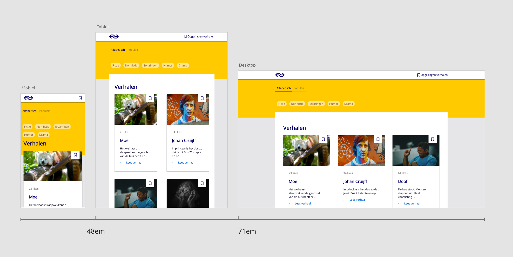
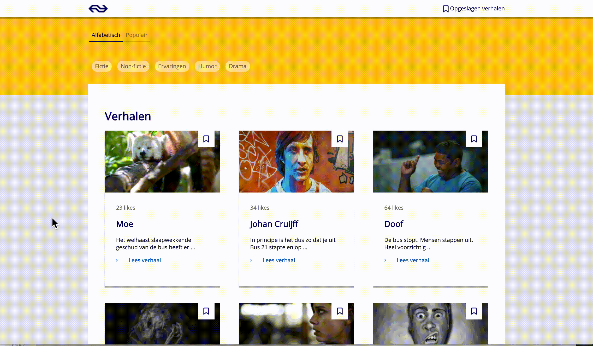
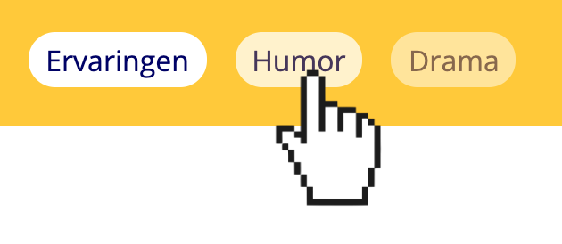

# NS verhalen - Project web

[Link naar demo](https://lriegen.github.io/WEB/)


## Meta data

- Lonneke Riegen
- 500712882
- Project Web Herkansing
- 30 oktober 2019


## Concept

De opdracht voor mijn schooljaar was een responsive website om online verhalen te lezen voor op reis, en deze
ontwerpen en maken. Deze moet aansluiten bij de huisstijl van NS. Verhalen dienen uniek te worden vormgegeven in een stijl die past bij het verhaal. Als UXer vind ik het belangrijk vooral dat het logisch is, en makkelijk tussen devices kan switchen. Hierdoor wilt ik het heel erg hetzelfde houden op verschillende maten. Daardoor heb ik het mobile-first gedesigned. Daardoor kwam er wel voor veel lozen ruimte. Ik bied nu de mogelijkheid om verhalen op te slaan om later (verder) te kunnen lezen.

## Responsive
Vanaf 48em gaat de layout over in het tablet design. Vanaf 71em past de layout zich aan naar het desktop design. Zie onderstaande afbeelding voor de breakpoint graph.



De website is mobile-first geprogrammeerd. De elementen die veranderen naarmate het scherm groter wordt, pas je aan door middel van een `media` query in css. Vanaf `48em` is tablet formaat en vanaf `71em`  desktop.
```css
/* Aside mobiel */
aside {
	background: #FFC917;
	width: 100%;
	padding: 0 1em 6em 0;
}

/* Aside tablet */
@media (min-width: 48em) {
	aside {
		padding: 0 10vw;
		height: 14em;
	}
}

/* Aside desktop */
@media (min-width: 71em) {
	aside {
		padding: 0 15vw;
	}
}
```

## Micro interacties

### Opslaan

**Trigger:** de bookmark button bij elk verhaal is de trigger.

**Rule:** wanneer het verhaal is opgeslagen, verschijnt een cijfer in het menu.

**Feedback:** het bookmark icoon wordt ingevuld en het cijfer verschijnt of verhoogt.

**Loop:** dit gebeurt elke keer wanneer de bookmark button wordt aangeklikt.

#### Werking
Om een event listener te geven aan alle bookmark buttons, maak ik een variable aan genaamd `bookmarkButtons` en selecteer ik ze allemaal met behulp van `querySelectorAll`.
```javascript
var bookmarkButtons = document.querySelectorAll('input.bookmark')
```
Vervolgens `loop` ik over alle buttons en tel ik het aantal geselecteerde buttons wanneer er een wordt aangeklikt. Tot slot voeg ik een class toe wanneer het aantal geselecteerde buttons hoger is dan 0 met de `classList.add()` functie.
```javascript
if (label.getAttribute('data-value') > 0)  {
	label.classList.add('bookmarks')
} else {
	label.classList.remove('bookmarks')
}
```
Met css kan ik het juiste aantal geselecteerde buttons in het label zetten.
```css
content:  attr(data-value);
```
Ik heb hier gebruik gemaakt van deze bestaande snippet: [http://jsfiddle.net/uq7ud/](http://jsfiddle.net/uq7ud/)

### Sorteren

**Trigger:** de filter knop is de trigger.

**Rule:** wanneer populair wordt geklikt, sorteren de verhalen op populairste verhalen.

**Feedback:** de verhalen sorteren direct op de gekozen optie.

**Loop:** de gebruiker kan altijd tussen alfabetisch en populair switchen.

#### Werking
Ik sorteer de verhalen voornamelijk met behulp van css. Wanneer er een class `popular` op de container van alle verhalen komt, verandert de `flex-direction`, waardoor de verhalen binnen die container worden omgedraaid.
```css
main div.popular {
	flex-direction: column-reverse;
}
```

Met JavaScript voeg ik deze class toe of verwijder ik het, door een event listener te zetten op de sorteer buttons.
```javascript
articles.classList.add('popular')
```

### Vind ik leuk

**Trigger:** het hartje icoon is de trigger waarop de gebruiker kan klikken.

**Rule:** het hartje wordt gevuld en de 'Likes' teller op de homepage wordt hoger.

**Feedback:** er verschijnt 'Vind ik leuk!' wanneer er wordt geklikt op het hartje.

**Loop:** de button kan altijd 'aan' en 'uit' worden geklikt.

#### Werking
Voor de animatie van het hartje met de 'Vind ik leuk!' tekst erboven, heb ik gebruik gemaakt van: https://codepen.io/kieranfivestars/pen/PwzjgN 
In plaats van een class te toggelen, gebruik ik een `checkbox input` waarmee ik met css kan uitlezen of de input `checked` is of niet.

```css
input:checked+label {
	background: url('../images/heart-filled.png') no-repeat center;
}
```


## Het verhaal


Om een 'moe' gevoel na te bootsen heb ik css animaties toegevoegd waardoor het lijkt alsof je bijna in slaap valt. Teksten beginnen te zweven en je komt steeds dichter bij dromenland. Wanneer je weer scrollt word je weer wakker en begint de css animatie opnieuw. Om dit te bereiken heb ik gebruik gemaakt van dit antwoord op Stack Overflow: https://stackoverflow.com/a/45036752


## Website ontwerpen
### Formulieren
#### Sorteren
Om de sorteer knoppen te stylen als een 'switch', maak ik gebruik van de volgende snippet: https://codepen.io/paulcp/pen/rjWZwp
```html
<form>
<fieldset class="switch-field">
	<legend>Filteren op</legend>
	<input type="radio" name="filter" value="alfabetisch" id="alfabetisch"  checked="">
	<label for="alfabetisch">Alfabetisch</label>
	<input  type="radio" name="filter" value="populair" id="populair">
	<label  for="populair">Populair</label>
</fieldset>
</form>
```
#### Bookmark buttons
De bookmark buttons zijn checkbox inputs om ze met css te kunnen stylen.

HTML
```html
<form>
	<fieldset>
		<legend>Bookmark</legend>
		<input class="bookmark" type="checkbox" name="bookmark1" id="bookmark1">
		<label for="bookmark1"></label>
	</fieldset>
</form>
```
CSS
```css
form input+label {
	background: url('../images/bookmark.png') no-repeat center;
}
form input:checked+label {
	background: url('../images/bookmark-filled.png') no-repeat center;
}

```
### Flexibele units
Afmetingen style ik in `em` en `vw` verhoudingen, waardoor elementen en teksten meeschalen met verschillende scherm- en/of fontgroottes.
```css
header  {
	padding: 0 1em;
}

@media (min-width: 48em) {
	header  {
		padding:  0  10vw;
	}
}

aside  {
	padding: 0 1em 6em 0;
}
```

### CSS selectors
**Universal selector**
```css
*  {
	box-sizing:  border-box;
}
```
**Descendant combinator**
```css
form legend {
	display: none;
}
```

**Child combinator**
(only targets immediate `child` elements)
```css
div>article {
	...
}
```
**Adjacent sibling combinator**
(targeted element must be an immediate sibling, not just a general sibling)
```css
input:checked+label {
	...
}
```
**Attribute selector**
```css
input[type="checkbox"] {
	...
}
```

**Pseudo-class**
```css
a:hover {
	text-decoration: underline;
}
```

### States


```css
input[type="checkbox"]+label {
  opacity: 0.5;
  transition: 0.2s;
}

input[type="checkbox"]+label:hover {
  cursor: pointer;
  opacity: 0.75;
}

input[type="checkbox"]:checked+label {
  opacity: 1;
  transition: 0.2s;
}
```
